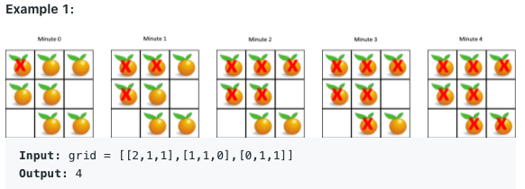

# Graph search

## BFS

case 1. rotting orange 



```java
Queue<int[]> q = new LinkedList<>();
for (int r = 0; r < grid.length; r++) {
    for (int c = 0; c < grid[0].length; c++) {
        if (grid[r][c] == 2) {
            q.offer(new int[]{r,c}); // store all initially starting to rotten point
        }
    }
}
//rotting started
int minutes = -1;
while (!q.isEmpty()) {
    int size = q.size();
    for (int s =0; s < size; s++) {
        int[] state = q.poll();
        int r0 = state[0];
        int c0 = state[1];

        for (int[] dir: dirs) {
            int r = r0 + dir[0];
            int c = c0 + dir[1];
            // check if it can move to neighbors
            if (r >= 0 && r < grid.length && c >= 0 && c < grid[0].length && grid[r][c] == 1) {
                q.offer(new int[]{r, c});
                grid[r][c] = 2; //rotten
            }
        }
    }
    minutes++; // 在run size of q的loop才能保证所有的rotten point 同时 expand 周围， 然后才能加时间
}
//check if all fresh orange rotten
for (int r = 0; r < grid.length; r++) {
    for (int c = 0; c < grid[0].length; c++) {
        if (grid[r][c] == 1) {
           return -1;
        }
    }
}
if (minutes == -1 ) return 0;
return minutes;
```

**Solution**:

1. We find initial state, in this problem it's grid element equals to 2. It could be mutiply points. 

2. We use Queue to store and track those point, and expand it to four directions. 
3. Given the condition, we add new expanded point to Queue for next round. 
4. Update the result we need, in this problem, we need update time. But we have to be careful the result is based on every round of loop of queue, not single queue state. It depends on problem by problem. 

## DFS

int[] nums = new int[] {1,2,3}

case 1: subset

```java
private void dfsSubset(int[] nums, int index, List<Integer> curr, List<List<Integer>> res) {
    if (index > nums.length) {
        return;
    }
    res.add(new ArrayList<>(curr));
    for (int i = index; i <nums.length; i++) {
        curr.add(nums[i]);
        dfsSubset(nums, i + 1, curr, res); // i+1 is key, to narrow down next element of nums[i]
        curr.remove(curr.size() - 1);
    }
}
```


As pic above seen, for (int i = index; i <nums.length; i++) is actually gradually reduce branches, dfsSubset(nums, i + 1, curr, res); is keep tree move to next state. At each node, it been added to res list. 


case 2: permutations 

```java
for (int i = 0; i < nums.length; i++) {
    //System.out.println("current index: " + i);
    if (!cur.contains(nums[i])) { //这个条件其实是砍掉了树枝
        //System.out.println("add value: " + nums[i]);
        cur.add(nums[i]);
        dfsPermute(nums, res, cur);
        //System.out.println("remove value " + cur.get(cur.size() -1));
        cur.remove(cur.size() - 1);
    }
}
```

Tree map look like 

​						

